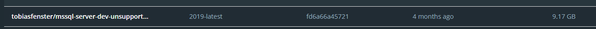
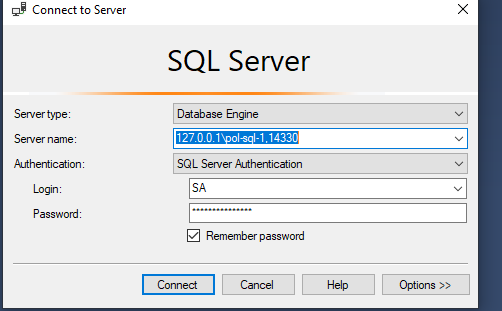
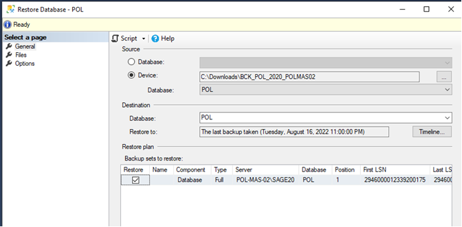
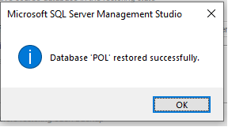
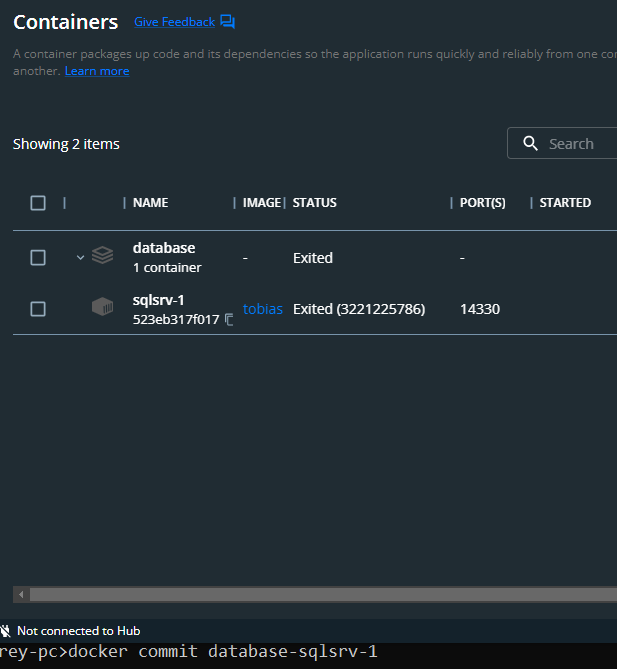

# Overview
This repo stores the core SQL databases used at PolanerSelections organization 

# Docker
Inside the ./Docker dir there are all required artifacts to create a docker image as well as instructions on how to
launch it on your machine or in cloud.

## Creating an image
1. Mount the directory with two backup files 
`copy the latest backup restore database files to [files] directory here in the root` Refer to volume definition part in
1.docker-compose file. Mount that [files] dir by following this instructions https://docs.docker.com/storage/volumes/.

2. Launch a docker with a vanilla Windows-based SQL Server Developer edition. 
`docker-compose up -f .Docker/1.docker-compose.yml`
Note, that SQL Server Express is not sufficient for our DB stack. 
One of the databases, namely MAS_POL weighs over 2GB in a MSSQLBACKUP file format. It means
after the backup restore the actual on-a-disk size will be over 10GB of data, thus exceeding the supported and allowed 
limit per Express edition.
After running the previous `docker compose` command you shall see the following new image within the Docker Desktop window 

3. Discover the backup files in the container
Now connect via the Command window to that image `tobiasfenster/mssql-server-dev-unsupported:2019-latest`.
Navigate to the mounted directory (during the step 1) `cd C:\data`. Run `dir`. You shall see two backup files POL and MAS_POL dbs.
You're all set to start the backup process. 

4. Restore DBs via SSMS
Note, on the exposed port in `1.docker-compose.yml` file - the containers exposes port `14330` and maps to `1433`.

Launch your SQL Server management studio (SSMS), on your dev desktop.
Use the following connection string format `127.0.0.1\{name of the running docker container}, {exposed port}`.
Use the login SA and corresponding password from the committed docker-compose file.

Perform two databases restores via SSMS
Restore POL and MAS_POL from docker's disk path, mounted volume `C:\data`.

You shall see the success Window

5. Save container with the restored DBs
Now you're ready to stop the container in Docker Desktop window. When it stops
run `docker commit {name of the pool}-{name of nested container}`

6. Save container to a file
docker save sqlsrv-1 > polaner-sql-db.tar.gz

7. Load container on another Docker host/machine
Note, that the example above is hosted on Windows-based host
docker load < polaner-sql-db.tar.gz

8. Push image to DockerHub and run in Azure
Alternative to steps 6 and 7, you may push the local image to a remote private DockerHub repository.
Refer to the following web-sites https://azure.microsoft.com/en-us/services/container-instances/ and 
https://stackoverflow.com/questions/28349392/how-to-push-a-docker-image-to-a-private-repository

